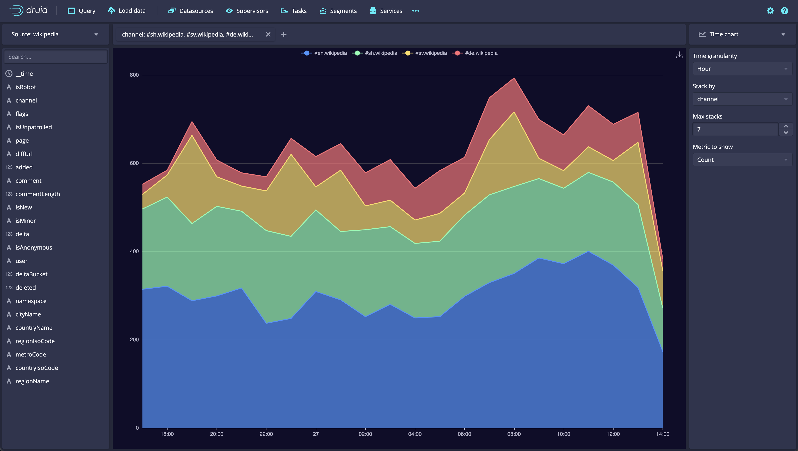
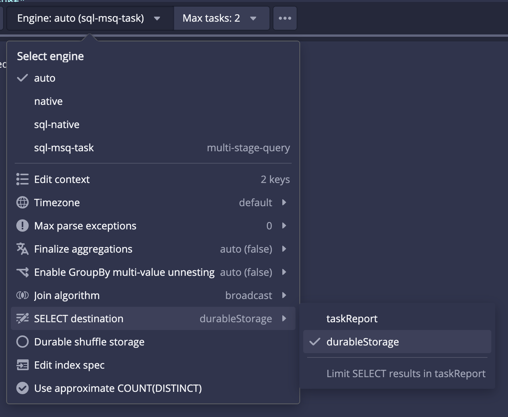
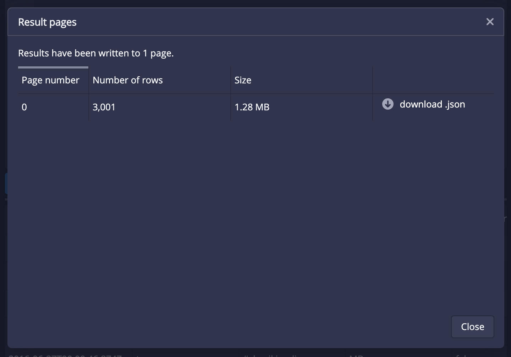
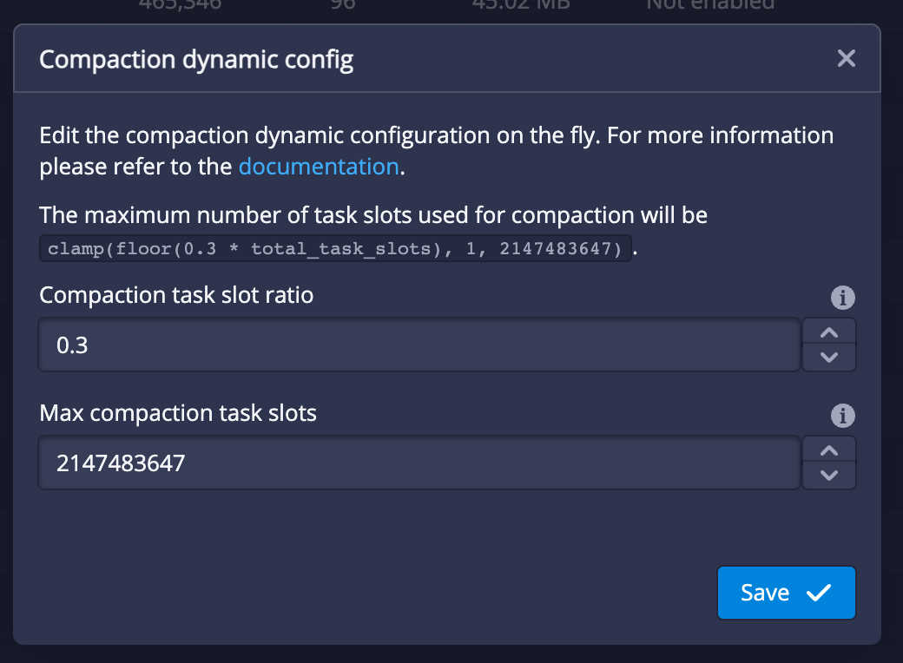

<!--Intentionally, there's no Apache license so that the GHA fails it. This file is not meant to be merged.
-->


Apache Druid 27.0.0 contains over $NUMBER_FEATURES new features, bug fixes, performance enhancements, documentation improvements, and additional test coverage from $NUMBER_OF_CONTRIBUTORS contributors.

[See the complete set of changes for additional details](https://github.com/apache/druid/issues?q=is%3Aclosed+milestone%3A27.0+sort%3Aupdated-desc+), including [bug fixes](https://github.com/apache/druid/issues?q=is%3Aclosed+milestone%3A27.0+sort%3Aupdated-desc+label%3ABug).

Review the upgrade notes and incompatible changes before you upgrade to Druid 27.0.0.

# Highlights

<!-- HIGHLIGHTS H2. FOR EACH MAJOR FEATURE FOR THE RELEASE -->

## New Explore view in the web console (experimental)

The Explore view is a simple, stateless, SQL backed, data exploration view to the web console. It lets users explore data in Druid with point-and-click interaction and visualizations (instead of writing SQL and looking at a table). This can provide faster time-to-value for a user new to Druid and can allow a Druid veteran to quickly chart some data that they care about.



The **Explore** view is accessible from the **More (...)** menu in the header:


[#14540](https://github.com/pull/14540)

## Query from deep storage (experimental)

Druid now supports querying segments that are stored only in deep storage. When you query from deep storage, you can query larger  data available for queries without necessarily having to scale your Historical processes to accommodate more data. To take advantage of the potential storage savings, make sure you configure your load rules to not load all your segments onto Historical processes. 

Note that at least one segment of a datasource must be loaded onto a Historical process so that the Broker can plan the query. It can be any segment though.

For more information, see the following:

- [Query from deep storage](https://druid.apache.org/docs/latest/querying/query-deep-storage.html)
- [Query from deep storage tutorial](https://druid.apache.org/docs/latest/tutorials/tutorial-query-deep-storage.html)

[#14416](https://github.com/apache/druid/pull/14416) [#14512](https://github.com/apache/druid/pull/14512) [#14527](https://github.com/apache/druid/pull/14527)

## Schema auto-discovery and array column types

Type-aware schema auto-discovery is now generally available. Druid can determine the schema for the data you ingest rather than you having to manually define the schema.

As part of the type-aware schema discovery improvements, array column types are now generally available. Druid can determine the column types for your schema and assign them to these array column types when you ingest data using type-aware schema auto-discovery with the `auto` column type.

Keep the following in mind when using these features:

- TBD

For more information about this feature, see the following:

-  [Type-aware schema discovery](https://druid.apache.org/docs/latest/ingestion/schema-design.html#type-aware-schema-discovery)
-  [26.0.0 release notes for Schema auto-discovery](https://github.com/apache/druid/releases#26.0.0-highlights-auto-type-column-schema-%28experimental%29-schema-auto-discovery-%28experimental%29).
- [26.0.0 release notes for array column types](https://github.com/apache/druid/releases#26.0.0-highlights-auto-type-column-schema-%28experimental%29).

## Smart segment loading

The Coordinator is now much more stable and user-friendly. In the new smartSegmentLoading mode, it dynamically computes values for several configs which maximize performance.

The Coordinator can now prioritize load of more recent segments and segments that are completely unavailable over load of segments that already have some replicas loaded in the cluster. It can also re-evaluate decisions taken in previous runs and cancel operations that are not needed anymore. Moreoever, move operations started by segment balancing do not compete with the load of unavailable segments thus reducing the reaction time for changes in the cluster and speeding up segment assignment decisions.


Additionally, leadership changes have less impact now, and the Coordinator doesn't get stuck even if re-election happens while a Coordinator run is in progress.

Lastly, the `cost` balancer strategy performs much better now and is capable of moving more segments in a single Coordinator run. These improvements were made by borrowing ideas from the `cachingCost` strategy.

For more information, see the following:

- [Upgrade note for config changes related to smart segment loading](#segment-loading-config-changes)
- [New coordinator metrics](#new-coordinator-metrics)
- [Smart segment loading documentation](https://druid.apache.org/docs/latest/configuration/index.html#smart-segment-loading)

[#13197](https://github.com/apache/druid/pull/13197) [#14385](https://github.com/apache/druid/pull/14385) [#14484](https://github.com/apache/druid/pull/14484)

### New query filters

Druid now supports the following filters:

- Equality: Use in place of the selector filter. It never matches null values.
- Null: Match null values. Use in place of  the selector filter. 
- Range: Filter on ranges of dimension values. Use in place of the bound filter. It never matches null values

Note that Druid's SQL planner uses these new filters in place of their older counterparts by default whenever `druid.generic.useDefaultValueForNull=false` or if `sqlUseBoundAndSelectors` is set to false on the SQL query context.

You can use these filters for filtering equality and ranges on ARRAY columns instead of only strings with the previous selector and bound filters.

For more information, see [Query filters](https://druid.apache.org/docs/latest/querying/filters.html)

[#14542](https://github.com/apache/druid/pull/14542)

### Guardrail for subquery results

Users can now add a guardrail to prevent subquery’s results from exceeding the set number of bytes by setting `druid.server.http.maxSubqueryRows` in the Broker's config or `maxSubqueryRows` in the query context. This guardrail is recommended over row-based limiting.

This feature is experimental for now and defaults back to row-based limiting in case it fails to get the accurate size of the results consumed by the query.

[#13952](https://github.com/apache/druid/pull/13952)

### Added a new OSHI system monitor

Added a new OSHI system monitor (`OshiSysMonitor`) to replace `SysMonitor`. The new monitor has a wider support for different machine architectures including ARM instances. We recommend switching to the new monitor. `SysMonitor` is now deprecated and will be removed in future releases.

[#14359](https://github.com/apache/druid/pull/14359)


## Java 17 support

Druid now fully supports Java 17.

[#14384](https://github.com/apache/druid/pull/14384)

## Hadoop 2 deprecated

Support for Hadoop 2 is now deprecated. It will be removed in a future release.

For more information, see the [upgrade notes](#hadoop-2-deprecated-1)

# Additional features and improvements

## SQL-based ingestion

### Improved query planning behavior

Druid now fails query planning if a CLUSTERED BY column contains descending order.
Previously, queries would successfully plan if any CLUSTERED BY columns contained descending order.

The MSQ fault, `InsertCannotOrderByDescending`, is deprecated. An INSERT or REPLACE query containing a CLUSTERED BY expression cannot be in descending order. Druid's segment generation code only supports ascending order. Instead of the fault, Druid now throws a query `ValidationException`.

[#14436](https://github.com/apache/druid/pull/14436)

[#14370](https://github.com/apache/druid/pull/14370)

### Improved segment sizes

The default `clusterStatisticsMergeMode` is now `SEQUENTIAL`, which provide more accurate segment sizes.

[#14310](https://github.com/apache/druid/pull/14310)

### Other SQL-based ingestion improvements

- The same aggregator can now have two output names [#14367](https://github.com/apache/druid/pull/14367)
- Enabled using functions as inputs for `index` and `length` parameters [#14480](https://github.com/apache/druid/pull/14480)
- Improved parse exceptions ASK FOR PR
- Temporary storage as a runtime parameter. MSQ will start honoring changes to the Middle Manager. ASK FOR PR TBD

## Ingestion

### Ingestion improvements

* If the Overlord fails to insert a task into the metadata because of a payload that exceeds the `max_allowed_packet` limit, the response now returns `400 Bad request`. This prevents an `index_parallel` task from retrying the insertion of a bad sub-task indefinitely and causes it to fail immediately. [#14271](https://github.com/apache/druid/pull/14271)
* A negative streaming ingestion lag is no longer emitted as a result of stale offsets. [#14292](https://github.com/apache/druid/pull/14292)
* Removed double synchronization on simple map operations in Kubernetes task runner. [#14435](https://github.com/apache/druid/pull/14435)
* Kubernetes overlord extension now cleans up the job if the task pod fails to come up in time. [#14425](https://github.com/apache/druid/pull/14425)

## MSQ task engine querying

In addition to the new [query from deep storage](#query-from-deep-storage-experimental) feature, SELECT queries using the MSQ task engine have been improved.

### Support for querying lookup and inline data directly

You can now query lookup tables directly, such as `SELECT * FROM lookup.xyz`, when using the MSQ task engine.

[#14048](https://github.com/apache/druid/pull/14048)

### Truncated query results

SELECT queries executed using MSQ  generate only a subset of the results in the query reports.
To fetch the complete result set, run the query using the native engine.

[#14370](https://github.com/apache/druid/pull/14370)

### New context parameter for query results

Added a query context parameter `MultiStageQueryContext` to determine whether the result of an MSQ SELECT query is limited .

[#14476](https://github.com/apache/druid/pull/14476)

### Query results directory

Druid now supports a `query-results` directory in durable storage to store query results after the task finishes. The auto cleaner does not remove this directory unless the task ID is not known to the Overlord.

[#14446](https://github.com/apache/druid/pull/14446)

## Querying

### New function for regular expression replacement

The new function `REGEXP_REPLACE` allows you to replace all instances of a pattern with a replacement string.

[#14460](https://github.com/apache/druid/pull/14460)

### HLL and Theta sketch estimates

You can now use `HLL_SKETCH_ESTIMATE` and `THETA_SKETCH_ESTIMATE` as expressions. These estimates work on sketch columns and have the same behavior as `postAggs`.

[#14312](https://github.com/apache/druid/pull/14312)

### EARLIEST_BY and LATEST_BY signatures

Updated EARLIEST_BY and LATEST_BY function signatures as follows:

* Changed `EARLIEST(expr, timeColumn)` to `EARLIEST_BY(expr, timeColumn)`  
* Changed `LATEST(expr, timeColumn)` to `LATEST_BY(expr, timeColumn)`

[#14352](https://github.com/apache/druid/pull/14352)

### INFORMATION_SCHEMA.ROUTINES TABLE

Use the new  `INFORMATION_SCHEMA.ROUTINES` to programmatically get information about the functions that Druid SQL supports. 

For more information, such as the available columns, see [ROUTINES table](https://druid.apache.org/docs/latest/querying/sql-metadata-tables.html#routines-table)

[#14378](https://github.com/apache/druid/pull/14378)

### New Broker configuration for SQL schema migrations

You can now better control how Druid reacts to schema changes between segments. This can make querying more resilient when newer segments introduce different types, such as if a column previously contained LONG values and newer segments contain STRING.

Use the new Broker configuration, `druid.sql.planner.metadataColumnTypeMergePolicy` to control  how column types are computed for the SQL table schema when faced with differences between segments.

Set it to one of the following:

- `leastRestrictive`: the schema only updates once all segments are reindexed to the new type.
- `latestInterval`: the SQL schema gets updated as soon as the first job with the new schema publishes segments in the latest time interval of the data.
  
`leastRestrictive` can have better query time behavior and eliminates some query time errors that can occur when using `latestInterval`.

[#14319](https://github.com/apache/druid/pull/14319)

### EXPLAIN PLAN improvements

The EXPLAIN PLAN result includes a new column `ATTRIBUTES` that describes the attributes of a query.

For more information, see [SQL translation](https://druid.apache.org/docs/latest/querying/sql-translation.html)

[#14391](https://github.com/apache/druid/pull/14391)

### New query filters

TBD

## Metrics and monitoring


### Monitor for Overlord and Coordinator service health

Added a new monitor `ServiceStatusMonitor` to monitor the service health of the Overlord and Coordinator.

[#14443](https://github.com/apache/druid/pull/14443)

### New Broker metrics

TBD for name changes

The following metrics are now available for Brokers:

|Metric|Description|Dimensions|
|------|-----------|----------|
|`segment/metadatacache/refresh/count`|Number of segments to refresh in broker segment metadata cache. Emitted once per refresh per datasource.|`dataSource`| | 
|`segment/metadatacache/refresh/time`|Time taken to refresh segments in broker segment metadata cache. Emitted once per refresh per datasource.|`dataSource`| | 

[#14453](https://github.com/apache/druid/pull/14453)

### New Coordinator metrics

|Metric|Description|Dimensions|Normal value|
|------|-----------|----------| --|
| `segment/loadQueue/assigned` | Number of segments assigned for load or drop to the load queue of a server. |`dataSource`,`server` | Varies |
| `segment/loadQueue/success` |Number of segment assignments that completed successfully.|`dataSource`, `server`|Varies|
| `segment/loadQueue/cancelled` |Number of segment assignments that were canceled before completion. |`dataSource`,`server` | 0 |
| `segment/loadQueue/failed` |Number of segment assignments that failed to complete.|`dataSource`, `server`|0|

[#13197](https://github.com/apache/druid/pull/13197)

### New metrics for task completion updates

| Metric | Description | Normal value |
| ------ | ----------- | ---------- |
| `task/status/queue/count` | Monitors the number of queued items | Varies |
| `task/status/updated/count` | Monitors the number of processed items | Varies |

[#14533](https://github.com/apache/druid/pull/14533)

### Added `groupId` to Overlord task metrics

Added `groupId` to task metrics emitted by the Overlord. This is helpful for grouping metrics like task/run/time by a single task group, such as a single compaction task or a single MSQ query.

[#14402](https://github.com/apache/druid/pull/14402)

### New metrics for monitoring sync status of `HttpServerInventoryView`

TBD for name change

|Metric|Description|Dimensions|Normal value|
|------|-----------|-----------|----------|
|`serverview/sync/healthy`|Sync status of the Coordinator/Broker with a segment-loading server such as a Historical or Peon. Emitted by the Coordinator and Brokers only when HTTP-based server view is enabled. This metric can be used in conjunction with `segment/serverview/sync/unstableTime` to debug slow startup of the Coordinator.|`server`, `tier`|1 for fully synced servers, 0 otherwise|
|`serverview/sync/unstableTime`|Time in milliseconds for which the Coordinator/Broker has been failing to sync with a segment-loading server. Emitted by the Coordinator and Brokers only when HTTP-based server view is enabled.|`server`, `tier`|Not emitted for synced servers.|

## Cluster management

### New property for task completion updates

The new property `druid.indexer.queue.taskCompleteHandlerNumThreads` controls the number of threads used by the Overlord `TaskQueue` to handle task completion updates received from the workers.

For the related metrics, see [new metrics for task completion updates](#new-metrics-for-task-completion-updates).

[#14533](https://github.com/apache/druid/pull/14533)


### Enabled empty tiered replicants for load rules

MENTION THAT THIS IS PART OF QUERY DEEP STORAGE

Druid now allows empty tiered replicants in load rules. Use this feature along with [query from deep storage](#query-from-deep-storage-experimental) to increase the amount of data you can query without needing to scale your Historical processes.

[#14432](https://github.com/apache/druid/pull/14432)

### Stabilized initialization of `HttpServerInventoryView`

The initialization of `HttpServerInventoryView` maintained by Brokers and Coordinator is now resilient to Historicals and Peons crashing. The crashed servers are marked as stopped and not waited upon during the initialization.

New metrics are available to monitor the sync status of `HttpServerInventoryView` with different servers.

[#14517](https://github.com/apache/druid/pull/14517)

## Web console

### Console now uses the new statements API for all MSQ interaction

The console uses the new `async` statements API for all **sql-msq-task** engine queries.
While this has relatively few impacts on the UX of the query view, you are invited to peek under the hood and check out the new network requests being sent as working examples of the new API.

You can now specify `durableStorage` as the result destination for SELECT queries (when durable storage is configured):




After running a SELECT query that wrote its results to `durableStorage`, download the full, unlimited result set directly from the Broker:



[#14540](https://github.com/apache/druid/pull/14540) [#14669](https://github.com/apache/druid/pull/14669) [#14712](https://github.com/apache/druid/pull/14712)

### Added UI around data source with zero replica segments

This release of Druid supports having datasources with segments that are not replicated on any Historicals. These datasources appear in the console like so: 


[#14540](https://github.com//pull/14540)

### Added a dialog for viewing and setting the dynamic compaction config

There's now a dialog for managing your dynamic compaction config:



### Other web console improvements

* Replaced the **Ingestion** view with two views: **Supervisors** and **Tasks**. [#14395](https://github.com/apache/druid/pull/14395)
* Added a new virtual column `replication_factor` to the `sys.segments` table. This returns the total number of replicants of the segment across all tiers. The column is set to -1 if the information is not available. [#14403](https://github.com/apache/druid/pull/14403)
* Added stateful filter URLs for all views. [#14395](https://github.com/apache/druid/pull/14395)


## Extensions

### Improved segment metadata for Kafka emitter extension

The Kafka emitter extension has been improved. You can now publish events related to segments and their metadata to Kafka.
You can set the new properties such as in the following example:

```properties
druid.emitter.kafka.event.types=["metrics", "alerts", "segment_metadata"]
druid.emitter.kafka.segmentMetadata.topic=foo
```

[#14281](https://github.com/apache/druid/pull/14281)

### Contributor extensions

#### Apache® Iceberg integration

You can now ingest data stored in Iceberg and query that data directly by [querying from deep storage](#query-from-deep-storage-experimental). Support for Iceberg is available through the new community extension. 

For more information, see [Iceberg extension](https://druid.apache.org/docs/latest/development/extensions-contrib/ice-berg.html)

[#14329](https://github.com/apache/druid/pull/14329)

## Dependency updates

The following dependencies have had their versions bumped:

* Apache DataSketches has been upgraded to 4.1.0. Additionally, the datasketches-memory component has been upgraded to version 2.2.0. [#14430](https://github.com/apache/druid/pull/14430)
* Hadoop has been upgraded to version 3.3.6 [#14489](https://github.com/apache/druid/pull/14489)
* Avro has been upgraded to version 1.11.1 [#14440](https://github.com/apache/druid/pull/14440)

## Developer notes

Introduced a new unified exception, `DruidException`, for surfacing errors. It is partially compatible with the old way of reporting error messages. Response codes remain the same, all fields that previously existed on the response will continue to exist and be populated, including `errorMessage`. Some error messages have changed to be more consumable by humans and some cases have the message restructured. There should be no impact to the response codes.


[`org.apache.druid.common.exception.DruidException`](https://github.com/apache/druid/blob/27.0.0/processing/src/main/java/org/apache/druid/common/exception/DruidException.java#L28) is deprecated in favor of the more comprehensive [`org.apache.druid.error.DruidException`](https://github.com/apache/druid/blob/master/processing/src/main/java/org/apache/druid/error/DruidException.java).

[`org.apache.druid.metadata.EntryExistsException`](https://github.com/apache/druid/blob/27.0.0/processing/src/main/java/org/apache/druid/metadata/EntryExistsException.java) is deprecated and will be removed in a future release.

[#14004](https://github.com/apache/druid/pull/14004) [#14554](https://github.com/apache/druid/pull/14554)

# Upgrade notes and incompatible changes

## Upgrade notes

### Worker input bytes for SQL-based ingestion

The maximum input bytes for each worker for SQL-based ingestion is now 512 MiB (previously 10 GiB).

[#14307](https://github.com/apache/druid/pull/14307)

### Parameter execution changes for Kafka

When using the built-in `FileConfigProvider` for Kafka, interpolations are now intercepted by the JsonConfigurator instead of being passed down to the Kafka provider. This breaks existing deployments.

For more information, see [KIP-297](https://cwiki.apache.org/confluence/display/KAFKA/KIP-297%3A+Externalizing+Secrets+for+Connect+Configurations)

[#13023](https://github.com/apache/druid/pull/13023)

### SQL compatibility mode

TBD

### Hadoop 2 deprecated

Many of the important dependent libraries that Druid uses no longer support Hadoop 2. In order for Druid to stay current and have pathways to mitigate security vulnerabilities, the community has decided to deprecate support for Hadoop 2.x releases starting this release. Starting with Druid 28.x, Hadoop 3.x is the only supported Hadoop version.

Consider migrating to SQL-based ingestion or native ingestion if you are using Hadoop 2.x for ingestion today. If migrating to Druid ingestion is not possible, plan to upgrade your Hadoop infrastructure before upgrading to the next Druid release.

### GroupBy v1 deprecated

GroupBy queries using the v1 legacy engine has been deprecated. It will be removed in future releases. Use v2 instead. Note that v2 has been the default GroupBy engine.

For more information, see [GroupBy queries](https://druid.apache.org/docs/latest/querying/groupbyquery.html)

### Push-based real-time ingestion deprecated

Support for push-based real-time ingestion has been deprecated. It will be removed in future releases.

### `cachingCost` segment balancing strategy deprecated

The `cachingCost` strategy has been deprecated and will be removed in future releases. Use an alternate segment balancing strategy instead, such as `cost`.

### Segment loading config changes

The following segment related configs are now deprecated and will be removed in future releases: 

* `maxSegmentsInNodeLoadingQueue`
* `maxSegmentsToMove`
* `replicationThrottleLimit`
* `useRoundRobinSegmentAssignment`
* `replicantLifetime`
* `maxNonPrimaryReplicantsToLoad`
* `decommissioningMaxPercentOfMaxSegmentsToMove`

Use `smartSegmentLoading` mode instead, which calculates values for these variables automatically.

Additionally, the defaults for the following Coordinator dynamic configs have changed:

* `maxsegmentsInNodeLoadingQueue` : 500, previously 100
* `maxSegmentsToMove`: 100, previously 5
* `replicationThrottleLimit`: 500, previously 10

These new defaults can improve performance for most use cases.

[#13197](https://github.com/apache/druid/pull/13197)
[#14269](https://github.com/apache/druid/pull/14269)

### `SysMonitor` support deprecated

Switch to `OshiSysMonitor` as `SysMonitor` is now deprecated and will be removed in future releases.

## Incompatible changes

### Removed property for setting max bytes for dimension lookup cache

`druid.processing.columnCache.sizeBytes` has been removed since it provided limited utility after a number of internal changes. Leaving this config is harmless, but it does nothing.

[#14500](https://github.com/apache/druid/pull/14500)

### Removed Coordinator dynamic configs

The following Coordinator dynamic configs have been removed:

* `emitBalancingStats`: Stats for errors encountered while balancing will always be emitted. Other debugging stats will not be emitted but can be logged by setting the appropriate `debugDimensions`.
* `useBatchedSegmentSampler` and `percentOfSegmentsToConsiderPerMove`: Batched segment sampling is now the standard and will always be on.

Use the new [smart segment loading](#smart-segment-loading) mode instead.

[#14524](https://github.com/apache/druid/pull/14524)


# Credits
Thanks to everyone who contributed to this release!

<list of gh ids>